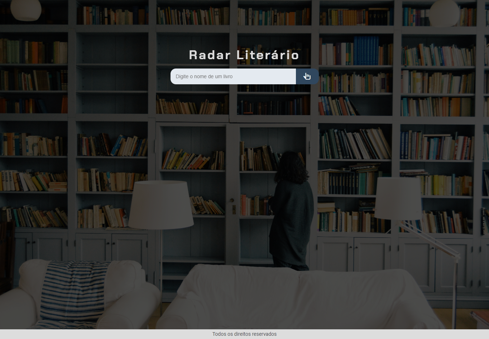

<h1 align="center">Radar Literário</h1>

## 📋 Descrição do projeto

O <strong><em>Radar Literário</em></strong> é um buscador de livros que permite encontrar informações detalhadas, como sinopse e autor, sobre obras cadastradas em nosso sistema. É um projeto desenvolvido com <strong><em>HTML</em></strong>, <strong><em>CSS</em></strong> e <strong><em>JavaScript</em></strong>, responsáveis pela estrutura, estilização e interação da página.

- O projeto foi desenvolvido durante a imersão da <a href="https://cursos.alura.com.br/imersao">Alura + Gemini</a>.

> HTML:
- Tags de texto e imagens;
- Tags semânticas;
- Classes e Ids;
 
> CSS:
- Propriedades de posicionamento; 
- Modo de exibição dos elementos;
- Seletores;
- Propriedades de alinhamento e espaçamento;
- Propriedades responsivas;
- Sombreamento de elementos;
- Web responsive (em andamento);

> JS:
- Listas e objetos;
- Funções e métodos.

> Protótipo:

🔗 [Clique aqui para acessar](https://imersao-alura-gemini-mocha.vercel.app/)

## 🛠️ Tecnologias
- HTML
- CSS
- JS

## 📩 Contato
> 📧 nathyrezendemachado@gmail.com  
> 💼 <a href="https://www.linkedin.com/in/nathalia-machado-021b1b230/"> LinkedIn</a>  
